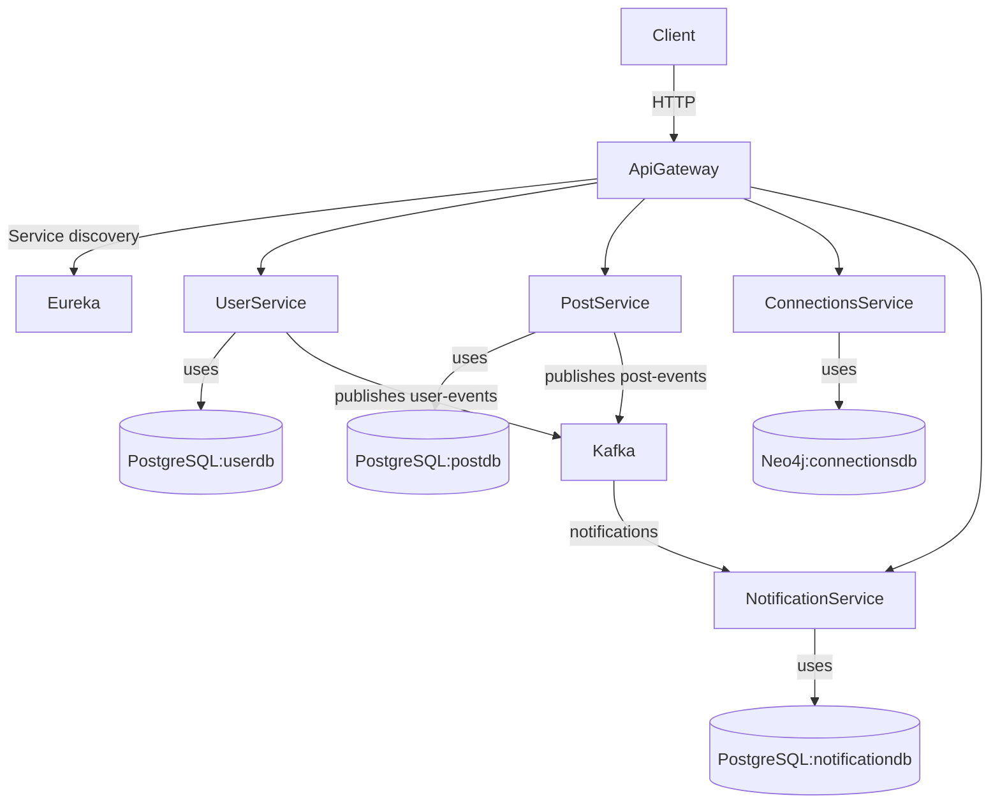

# Connectify  

A microservices-based social networking application built with Java Spring Boot. The platform focuses on **connections**, **posts**, **notifications** and **user management**. Each domain is implemented as an independent service and orchestrated via an API Gateway and a discovery server.

## Architecture Overview  

Connectify follows a *service‑oriented architecture* where distinct Spring Boot services interact via REST and Kafka messages. An **API Gateway** exposes unified endpoints and handles routing, while a **Eureka Discovery Server** provides service registration and discovery. The services persist data to appropriate storage engines (PostgreSQL for relational domains and Neo4j for graph relationships).  

- **API Gateway**: A Spring Cloud Gateway running on port `8078`. It registers with the Eureka server and forwards incoming requests to the correct service based on URI patterns. The configuration in `application.yml` defines route predicates for each downstream service.  
- **Discovery Server (Eureka)**: Provides service registry. All microservices (user, post, connections, notification and API Gateway) register here so they can discover each other dynamically.  
- **User Service**: Handles user registration, authentication and profile management. Uses PostgreSQL (`userdb`) to store user entities. Publishes events to Kafka topics (`user‑events`) when user profiles change.  
- **Post Service**: Manages creating, updating and retrieving posts. Stores post data in PostgreSQL (`postdb`). Produces events (`post‑events`) to Kafka when a post is created or updated.  
- **Connections Service**: Manages relationships between users (follow/unfollow). Utilizes **Neo4j** (`connectionsdb`) because user relationships form a graph.  
- **Notification Service**: Listens to Kafka topics (user and post events) and generates notifications. Uses PostgreSQL (`notificationdb`) to persist notifications and sends them to users via a message queue.  
- **Kafka Broker**: Provides asynchronous communication via topics. Topics observed in the codebase include:  

  - `user‑events` — events emitted by the User Service when user state changes  
  - `post‑events` — events emitted by the Post Service for new or updated posts  
  - `notifications` — events consumed/produced by the Notification Service  

- **Databases**:  

  | Service | Database | Notes |  
  |--------|----------|------|  
  | User Service | **PostgreSQL** (`userdb`) | Stores user accounts, credentials and profile information. |  
  | Post Service | **PostgreSQL** (`postdb`) | Stores posts and associated metadata such as text and timestamps. |  
  | Notification Service | **PostgreSQL** (`notificationdb`) | Persists notifications for users. |  
  | Connections Service | **Neo4j** (`connectionsdb`) | Stores user relationships as a graph (followers and followees). |  

Redis is not yet used in this repository but could be introduced later for caching frequently accessed data (e.g., profile information or trending posts).

## Service Endpoints  

Below are some example endpoints implemented in the services (paths start from the API Gateway):

- `GET /api/v1/users/{id}` – Retrieve a user by ID.  
- `POST /api/v1/users/register` – Register a new user.  
- `GET /api/v1/posts` – Retrieve all posts.  
- `POST /api/v1/posts` – Create a new post.  
- `POST /api/v1/connections/follow` – Follow another user.  
- `POST /api/v1/connections/unfollow` – Unfollow a user.  

> **Note:** Endpoints may vary based on implementation details in the respective services. The API Gateway routes requests to the appropriate downstream service using path predicates defined in its configuration.

## Running Locally  

The repository includes a `docker-compose.yml` file that orchestrates the services and their databases. To start the entire stack:  

1. Ensure Docker and Docker Compose are installed.  
2. Clone this repository.  
3. From the project root, run:  

   ```bash  
   docker-compose up --build  
   ```  

This will build the service images and start containers for the API Gateway, Eureka server, individual services, PostgreSQL databases, a Neo4j instance, Kafka broker, Kafka UI and Zipkin for distributed tracing. Once running, you can access the services through the API Gateway at `http://localhost:8078`.  

## Architecture Diagram  

Below is a Mermaid diagram that visualizes the Connectify architecture:



## Future Enhancements  

- **Redis caching**: Integrate Redis to cache frequently accessed data.  
- **GraphQL API**: Provide a GraphQL gateway for flexible client queries.  
- **Enhanced security**: Implement OAuth2 / JWT for secure authentication across services.  

## About This Repository  

This repository is part of a microservices portfolio demonstrating core patterns in distributed systems: service discovery, API gateways, event‑driven communication and polyglot persistence. Feel free to explore each service folder to learn more about how they are built.
